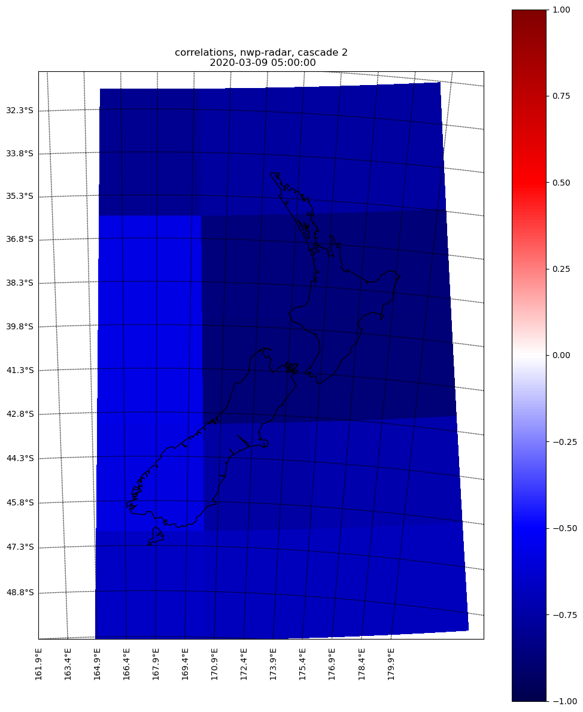
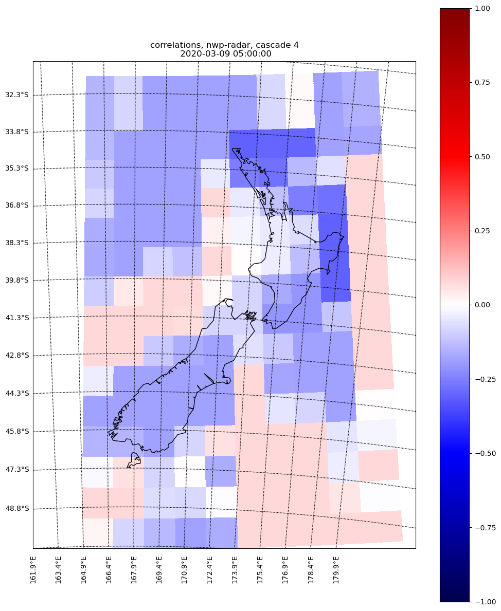
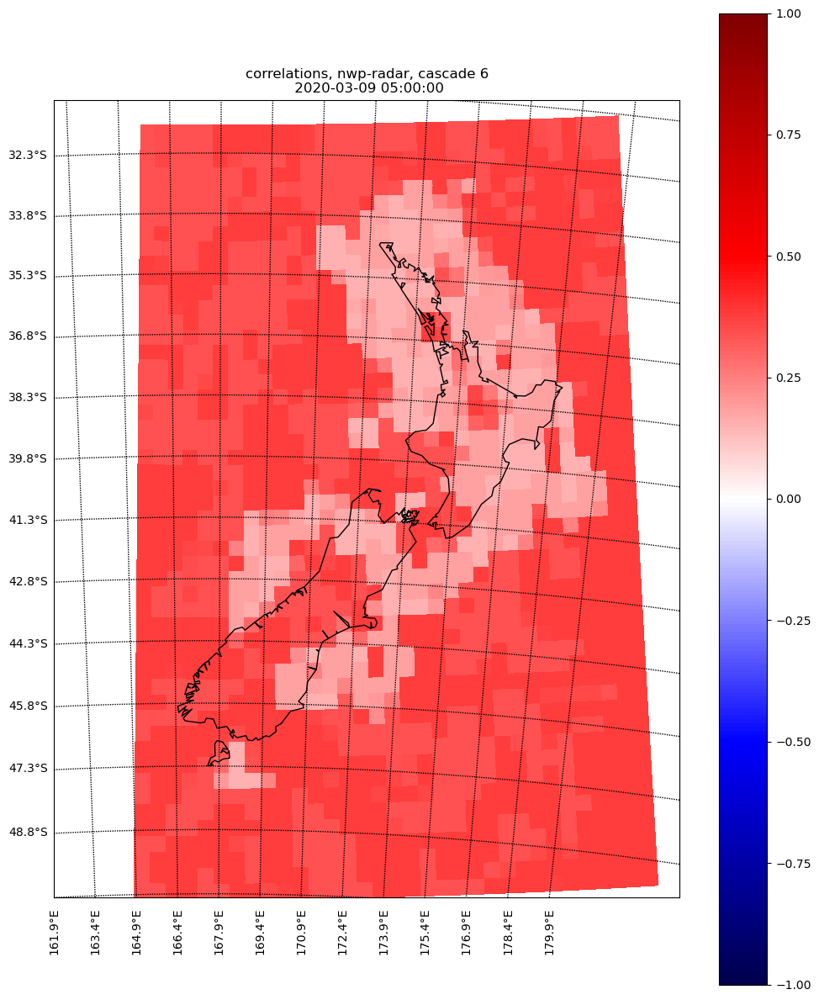

The skill difference between NWP and radar extrapolation at T0
===============================================================

The initial skill difference between NWP and radar extrapolation largely determines the skill of short term rainfall forecasts, here an example is given. The skill of radar extrapolation is from T+2hrs:

The full gallery can be downloaded at :download:`decomposed diff gallery <corr_diff_t0.tar.gz>`
