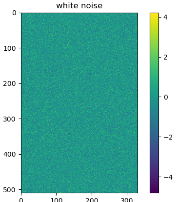
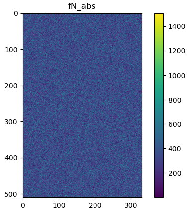
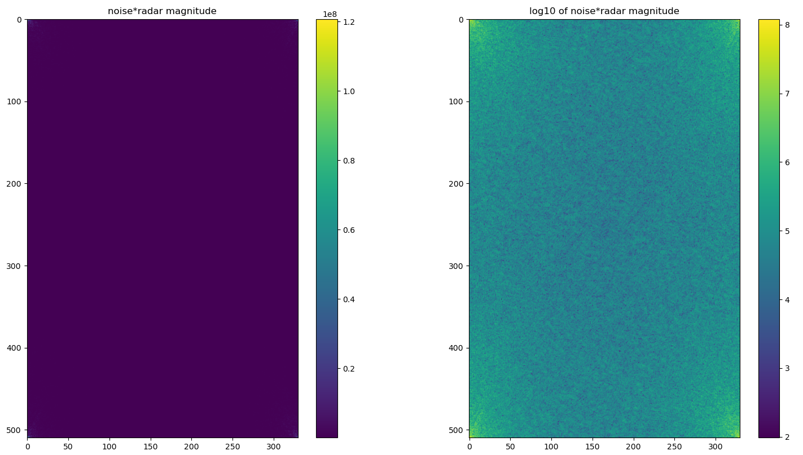
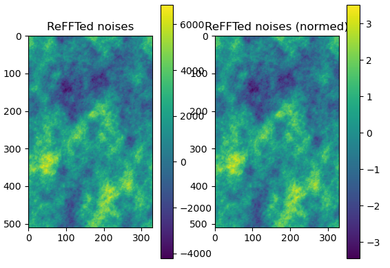
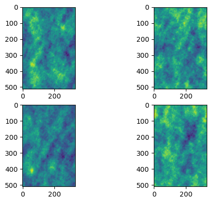
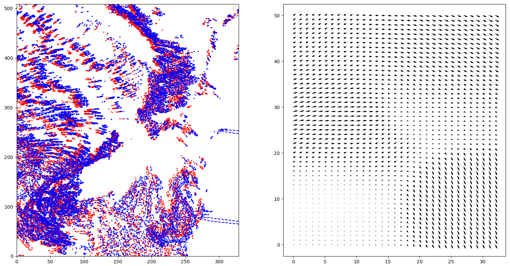
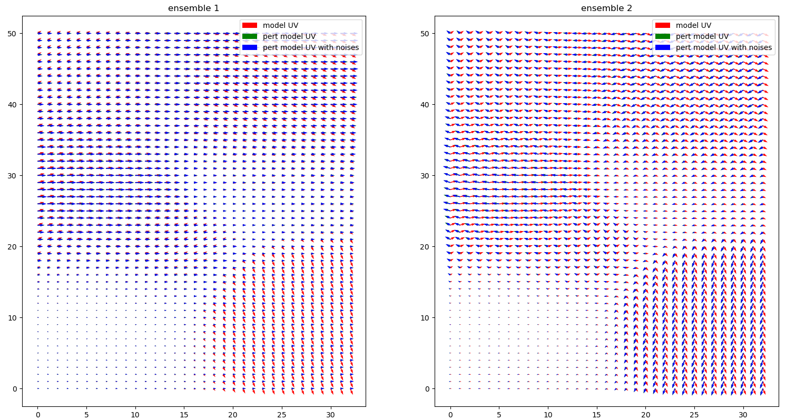
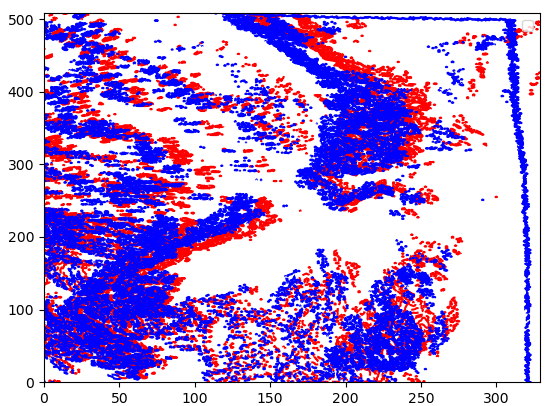
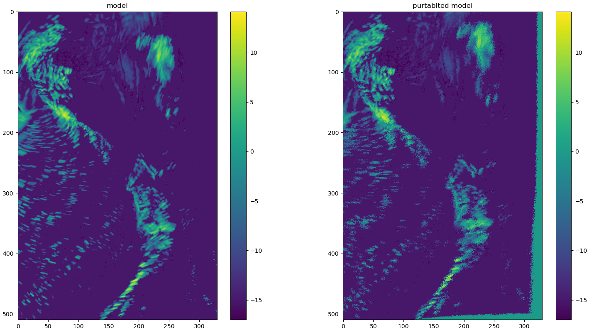

Stochastic noise
====================

The noise is created by the following step:
 - first creating a random 2d noises array (with white noise)
 - such a random noise array is to be composed into cascades
 - All the cascades are multiplied with the corresponding abs value of radar cascades. By doing this, we expect that the noises would have similar spatial scale ratio as the radar data
 - last we convert all the noises cascades back to the regular one
 - normalize the nosies

1. Random noise
^^^^^^^^^^^^^

The following codes created to generate the 2d noises array::

    N = numpy.random.randstate.randn(input_shape[0], input_shape[1])

The above noise has the mean of 0.0 and the std of 1.0

1.1 Random noise decomposition
'''''''''''''''''''''''''''''''

The noises is decomposed into cascades, note since this is a "random" one, therefore we don't see spatial scale features from the decomposed one::

    fN = numpy.fft.fft2(N)
    fN_abs = abs(fN)
    plt.imshow(fN_abs)
    plt.colorbar()

1.2 Apply the absolute value of radar cascades to noises
'''''''''''''''''''''''''''''''''''''''''''''''''''''''''

We multiply the decomposed nosies with the corresponding absolute value of radar cascade::

    F_abs = F["field"]
    fN *= F_abs

Through this the similar spatial scale ratio of radar data would be applied to the noises.

From the above we see that the noises now has more weights over the large scales (similar to radar data)

1.3 reFFT and normalize the noise
''''''''''''''''''''''''''''''''''

At the last step the noises have to converted back from FFT and normized:

If we have more than one ensemble, we see that they all have similar spatial scales as radar data but different distributions:

Note that the large scale features in the above figures might not be used at all since we expect the large scale patterns from NWP (or radar extrapolation) are good enough.

2. Perturbated noises
^^^^^^^^^^^^^^^^^^^^^
Compared to the random noises in the last section, the option of using the perturbated noises adds the random optical flows to the radar/NWP fields. The weight is determined by the spectral weighting function estimated before

Random OF is created around the OF created between model(t) and model(t+1):

The above OF is perpurbated by (1) a constant random value multiplied over the entire domain, and (2) a random coefficients array added to the OF. The following gives two ensembles of the perturbated OF:

Random OF is created around the OF created between model(t) and model(t+1):

The model data then is extrapolated using the purterbated OF:

Similar we can create the perturbated noises. All the perturbated noise and model are decomposed.

3. Discussion
^^^^^^^^^^^^^^^^^^^^^
It is recommended to use the random noises in RainCast. For example, given there is big difference between NWP and radar, perturbated noise may need to abrupt changes over the transition (or the missing of small scale information from the blended forecasts since the perturbated noise may be not available, or big enough, over the expected area). 

