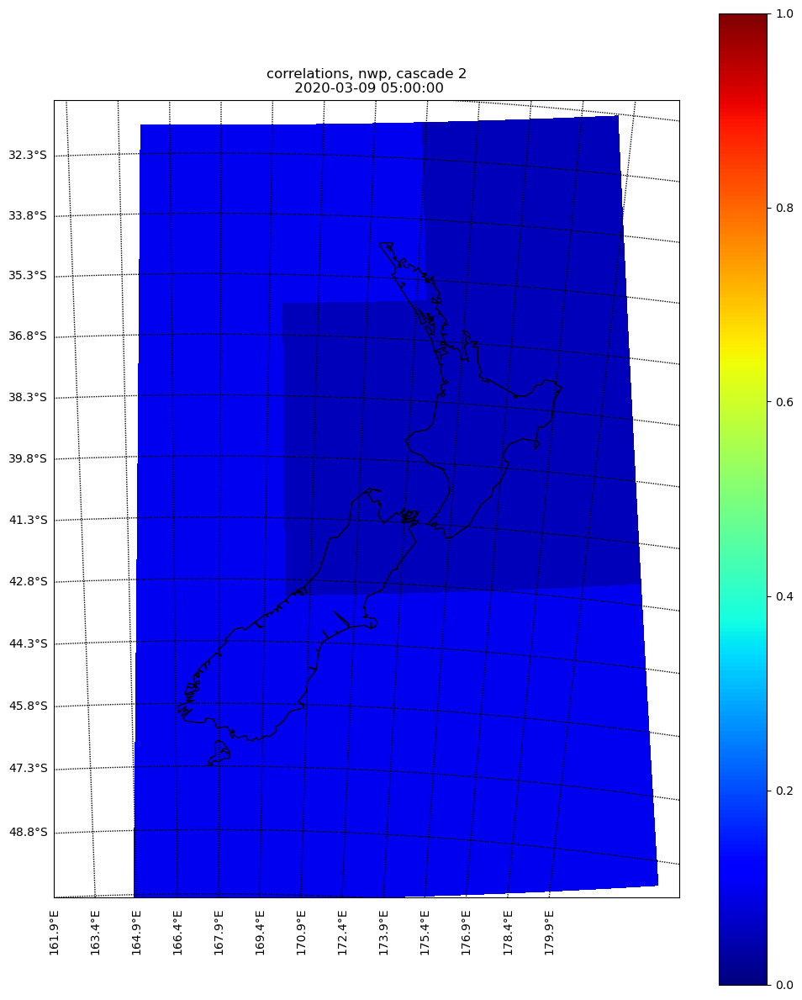
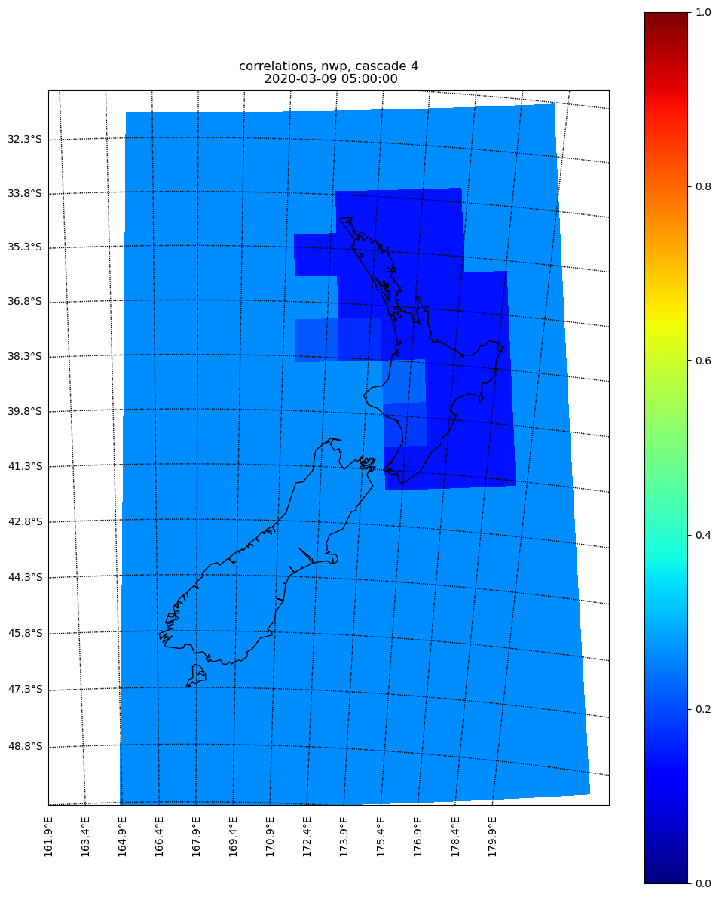
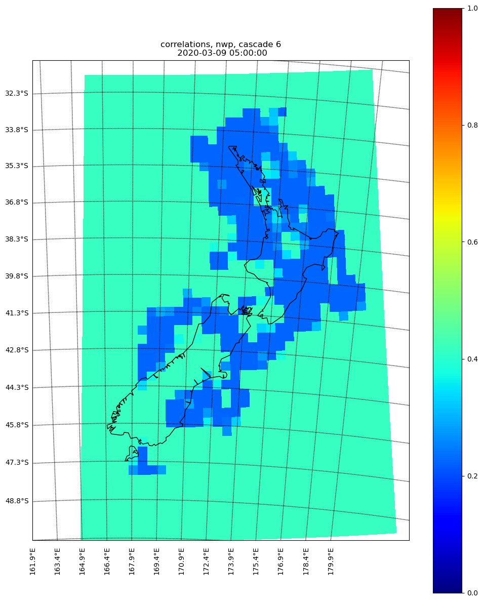

Calculate the correlation for NWP at T0
==========================================

Similar to the radar extrapolation, the skills of NWP must be calculated at the analysis time (aginst the observation).

Temporal correlation
^^^^^^^^^^^^^^^^^^^^^

Unlike radar extrapolation, there is no need to create the temporal correlation for NWP

Spatial correlation
^^^^^^^^^^^^^^^^^^^^^

The following codes give the spatial correlation for NWP forecast and radar observation at T0::

    if run_in_parallel:
        dask_jobs = []
    
    for kk in range(n_cascade_levels):
        if run_in_parallel:
            dask_jobs.append(dask.delayed(_get_rho)(
                model_data_at_steps_analysis_time, 
                radar_data_at_steps_analysis_time,
                kk, use_fss,
                hist_cli_dir, cascade_grid,
                mask_model, match_cdf,
                spatial_corr, cur_corr_size,
                raincast_time))
        else:
            cur_corr = _get_rho(
                model_data_at_steps_analysis_time, 
                radar_data_at_steps_analysis_time,
                kk, use_fss, hist_cli_dir, cascade_grid,
                mask_model, match_cdf,
                spatial_corr, cur_corr_size,
                raincast_time)
            r_model.append(cur_corr)

The correlations for NWP forecasts have to be calculated over all cascades. 

Here are the examples (with cascades 2, 4 and 6) of the spatial correlation over different cascades, we noticed that the skill is very little within the radar range (outside of the radar range it is better since the "ground truth" also comes from NWP)

The full gallery can be found here :download:`nwp correlation gallery <corr_nwp.tar.gz>`. Note that the output *rho_model* is a list with length of total *cascades*, within the list it is a 2d array having the dimension of *(x, y)*.

Also, one might ask, given the "ground truth" outside of radar also comes from NWP, why the skill of NWP forecast is still very low. It is due to that the spatial skill is constrained by the domain average (within radar) skill, it must be within a range of, e.g., (-30%, +30%)

