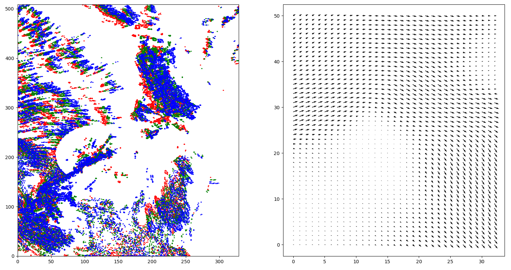

Optical Flow
================

The Dense Lucas-Kanade Method from *CV2* is used to create the optical flow from continuous radar images::

    V = optical_flow.dense_lucaskanade(R_radar)

Where *R_radar* has the shape as *(3, 510, 330)* and the output *V* has the shape of *(2, 510, 330)*, one can view the OF using::

    import matplotlib.pyplot as plt
    plt.subplot(121)
    plt.contour(R_radar[0, :, :], colors='r')
    plt.contour(R_radar[1, :, :], colors='g')
    plt.contour(R_radar[2, :, :], colors='b')
    plt.subplot(122)
    skip = (slice(None, None, 10), slice(None, None, 10))
    u = V[0, :, :]
    v = V[1, :, :]
    plt.quiver(u[skip], v[skip])

